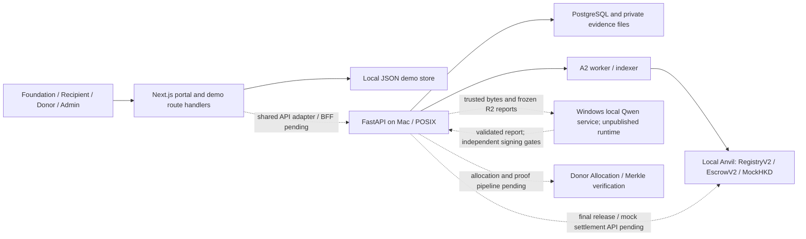

# Proof of Giving (PoG)

PoG is a donation and procurement prototype for the HacKU 2026 FinTech MVP.
Donations are locked to a project; purchases and releases require evidence and
human approval; Donors can inspect how funds are used.

Repository: [Eason-NotFound/PoG](https://github.com/Eason-NotFound/PoG).

## What is available today

Documentation snapshot: **2026-10-04**, based on published main
`d74a7a0ef53abe32640f019ce1551bf5c2432826`. This update describes that source;
it does not claim a new runtime test or complete product acceptance.

| Module | Published implementation | Integration still needed |
| --- | --- | --- |
| Frontend | Next.js/React/TypeScript portal with Foundation, Recipient, Donor and Admin workspaces; sessions, access checks and local JSON persistence | Replace the demo adapter with the shared API and display confirmed chain/model results |
| API and database | FastAPI, PostgreSQL, migrations, evidence versions, durable worker/indexer and local A2 contract adapter | Real AI report storage/transport and the final release, settlement and refund API path |
| Contracts | MockHKD, PoGRegistryV2 and ProcurementEscrowV2; custody, approvals, receipt signatures, Foundation release, mock settlement and refunds | Complete UI/API orchestration of the contract capabilities |
| Local chain tools | M3.1 Anvil deployment/verification and M3.2 isolated API/chain verification tools | Integrated frontend rehearsal on an exact shared deployment |
| AI interface | Frozen two-stage R2 schemas, canonical bytes/hash tools, examples and validation vectors in `docs/ai` | Publish and integrate the actual Qwen service; approve and validate scoring/signing policy |
| Payment evidence | V2 release and mock settlement commitments; demonstration plans | API/UI payment evidence, reconciliation and recovery workflow |
| Donor Allocation and Merkle verification | Demonstration records and historical contract hooks | Actual allocation computation, proof generation and Donor verification integration |

**Current main is a set of runnable components, not a connected end-to-end
prototype.** The portal uses `.data/pog-demo.json`. The published A2 HTTP flow
stops at `ReceiptConfirmed`. AI format freeze and CI results do not prove a
deployed model, payment service or frontend-to-chain transaction.

The separate local Qwen candidate uses Qwen3-VL-2B-Instruct without a loaded
LoRA adapter. It supports single-page PrePurchase PO extraction and diagnostics.
Its runtime source and model weights are not published here. The diagnostic
report is Review, incomplete and unscored, with signing disabled; FinalRelease
review is not implemented. Bounded cross-machine synthetic-sample calls and
report-hash/file-save checks do not establish full two-stage AI acceptance.

## Business flow and approval boundaries

1. Foundation creates a project. Donors simulate HKD-to-MockHKD conversion and
   deposit MockHKD directly into that project's Escrow.
2. A procurement request and PO are reviewed by **PrePurchase AI**. A separate
   **human procurement approval** authorizes the budget reservation.
3. Vendor delivers. Foundation supplies Invoice/goods evidence; Recipient or
   an independent receiver supplies acceptance evidence and the Recipient signs
   the receipt bound to that procurement.
4. **FinalRelease AI** compares the approved purchase, Invoice and delivery
   evidence. A separate **human release approval** authorizes release of the
   approved Invoice amount to Foundation.
5. Foundation performs simulated redemption and supplier payment. Payment
   evidence and **human settlement confirmation** are recorded separately.
6. Donor allocation and evidence proofs are intended to explain spending. Active
   remainder stays locked; after closure and reconciliation, eligible remaining
   MockHKD is refunded proportionally to original Donor wallets.

AI provides risk evidence; it does not approve procurement or payment. Procurement
approval does not authorize release. `FundsReleasedToFoundation` does not mean
the supplier has been paid. MockHKD, mock conversion and mock supplier settlement
do not represent real HKD banking or real-value payment.

See [Project overview](docs/PROJECT_OVERVIEW.md) and
[Foundation settlement flow](docs/FOUNDATION_SETTLEMENT_FLOW.md).

## Architecture

Solid lines below are published component connections. Dashed lines are target
connections or capabilities still awaiting integration. They are not evidence
of a running full stack.



The intended two-machine setup places API/PostgreSQL/Anvil on the Mac and Qwen
inference on Windows. The intended browser route is a same-origin Next.js BFF
which forwards to the Mac's loopback API; browsers must not receive the model
token or an unlocked Anvil RPC. The AI model does not hold signing keys.
Exact EIP-712 fields, enums and hash recipes remain in the frozen interfaces.

## Repository map

| Path | Purpose |
| --- | --- |
| `src/app`, `src/components`, `src/lib` | Portal, local demo routes, permissions and persistence |
| `services/api` | FastAPI application, PostgreSQL migrations, worker/indexer and tests |
| `contracts` | Solidity source, vendored dependencies, tests and local deployment outputs |
| `packages/contract-abis` | Versioned ABI handoff artifacts |
| `scripts` | Chain startup/verification, API/chain checks and fixture checks |
| `docs/ai` | Frozen AI protocol, schemas, canonicalization tools and synthetic vectors |
| `docs/api` | Published A1/A2 scope, interfaces and operator runbooks |
| `design`, `docs/booth` | UI design and rehearsal preparation |

Raw evidence, private credentials, model weights, databases and runtime logs
stay outside Git. Public examples are synthetic fixtures, not model accuracy
or real-payment evidence.

## Run the published components

These are separate entry points. Starting all three does not connect the portal
to A2 or start Qwen. Run commands from the repository root.

### Frontend demo

Requires Node.js 22+. Follow [Portal runbook](docs/PORTAL_README.md) for accounts
and demo settings.

```sh
npx pnpm@11.25.0 install --frozen-lockfile
cp .env.example .env.local
npx pnpm@11.25.0 dev
```

PowerShell users can copy configuration with `Copy-Item .env.example .env.local`.
Open `http://localhost:3000`. This runs the local JSON demo, including fixed AI
examples; it does not call the real model or contracts.

### API and PostgreSQL

The committed runtime lock targets **macOS arm64**. Follow
[API README](services/api/README.md) to initialize the owned database, apply
migrations and prepare private configuration. Its existing entry points are:

```sh
conda create --prefix .local/runtime --file services/api/conda-osx-arm64.lock
.local/runtime/bin/python -m pip install --requirement services/api/requirements.lock
services/api/scripts/postgres-local.sh up
. .local/postgres/connection.env
export POG_STORAGE_ROOT="$PWD/.local/api-storage"
export POG_A1_RUN_ID=a1-local-run
export POG_A1_INSTANCE_ID=a1-local-instance
(cd services/api && ../../.local/runtime/bin/alembic upgrade head)
PYTHONPATH=services/api/src .local/runtime/bin/python -m pog_api
```

Open `http://127.0.0.1:8080/docs`; readiness is `/ready`. For A2, use the explicit
deployment, opt-in configuration, worker and indexer steps in
[A2 runbook](docs/api/A2_RUNBOOK.md). The API does not start or reset Anvil.

### Anvil and contracts

Requires pinned Foundry 1.8.4 and Python 3. The existing chain launcher uses
POSIX facilities including `fcntl`; native Windows support is not established.

```sh
python3 scripts/local-chain.py up
python3 scripts/local-chain.py status
python3 scripts/local-chain.py verify
```

Use the actual ignored `contracts/deployments/local/manifest.json`, not copied
addresses. RPC is loopback-only, chain ID 31337. Read
[M3.1 runbook](docs/M3_1_RUNBOOK.md) before stop/reset; stopping does not promise
a resumable business chain. Faucet balances are not fiat conversion.

There is no public Qwen startup command in this source version. Its model/service
delivery and private configuration must be reviewed before adding one.

## Verification and integration work

Published component checks have separate scopes:

```sh
npx pnpm@11.25.0 test
npx pnpm@11.25.0 typecheck
npx pnpm@11.25.0 build
bash scripts/check-blockchain.sh
```

[API test instructions](services/api/README.md#tests) use a guarded, managed
test database. [Offline AI tools](docs/ai/tools/README.md) validate bytes and
hashes without model calls, signatures or transactions. Test counts must be
reported for the exact version actually run.

The next integration work is to publish the scoped AI runtime, connect trusted
API snapshots and report storage, replace the portal demo adapter, and wire
final release/settlement and Donor proofs. Acceptance must then trace actual
frontend actions through API operations, database changes, model reports,
chain receipts and final output. A successful build or interface check alone
does not close that work.

## Further documentation

- [Project overview](docs/PROJECT_OVERVIEW.md)
- [Current status and historical acceptance records](docs/STATUS.md)
- [Milestones and remaining integration](docs/MILESTONES.md)
- [Published API A2 status](docs/api/A2_STATUS.md)
- [Frozen AI format and A2 integration boundary](docs/ai/V2_A2_INTEGRATION_PROFILE_001.md)
- [Exact implemented V2 interface](docs/M2_V2_INTERFACE_IMPLEMENTED.md)
- [Booth rehearsal plan](docs/BOOTH_MOCK_RUN.md)
- [Version control and acceptance](docs/VERSION_CONTROL.md)

Historical M1 and M2 specifications, accepted tags and frozen technical
artifacts remain unchanged. Documentation describes approved scopes; it does
not authorize an automatic merge, deployment or real payment.
