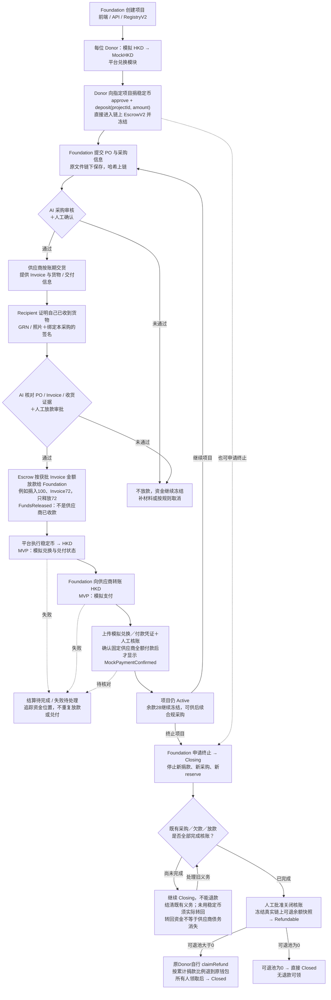

# PoG — Foundation 兑付与供应商结算流程

日期：2026-10-03。状态：用户已确认新版 M2 可以继续，按获批 Invoice 金额放款；
存续余款冻结，终止核账后按比例原路退稳定币。V2实现与独立技术验收已完成，
81/81测试通过；等待用户阶段验收，
不代表真实 HKD／稳定币兑付已经接入。

本次流程取代 M2 原计划的「Escrow 直接向供应商支付稳定币」。
已验收的 `blockchain-v0.1.0-m1` 和旧 RC 保持不变。旧架构 M2 编码及其验收
测试已停止。新版实施范围已冻结在 `M2_V2_SPEC.md`，另建 RegistryV2 / EscrowV2。
旧 Escrow 未提交草稿无损保存在忽略的本地归档中，不编译、不上传，非候选实现。

## 当前流程图

每位 Donor 先在平台把模拟 HKD 兑换为 MockHKD，再以稳定币向指定项目捐款。
捐款直接存入该项目的链上 Escrow 并锁定，不先进入 Foundation 的 HKD 账户。
用户确认两次兑换均模拟；Recipient 确认收货，Foundation 最终向供应商支付 HKD。



## 谁负责什么

- Donor：先将自己的模拟 HKD 换成 MockHKD；只能向指定项目捐款，资金直接进入
  该项目 Escrow，不能直接捐入 Foundation 的自由余额。
- Foundation：创建项目、提交 PO／采购材料；获批后领取稳定币、
  通过平台换回 HKD，再向固定供应商付款并提交付款证据。
- Recipient：证明本采购的货物已经收到，不因为确认收货而自动获得资金审批权。
  使用绑定项目／采购／PO／Invoice／货物／收货证据的独立 EIP-712 签名。
- AI：第一次检查 PO／采购材料；第二次比对 PO、Invoice、货物信息与收货证据。
  AI 只产生风险报告，不替代人工批准、不自行执行兑付。
- 人工审批人：查看 AI 结果与收货证明，签署明确金额与收款 Foundation 的放款批准。
- Smart Contract：托管／冻结稳定币，验证必要签名和证据绑定，执行一次性放款，
  记录真实链上资金变化。不能直接证明货物真实到达或银行真实到账。
- 平台兑换与 Payment 模块：处理 HKD↔稳定币的操作资源、报价／状态／对账，
  追踪 Foundation 的 HKD 供应商支付；不能把链上 mint/burn 当作真实法币兑付。
- API／数据库与前端：保存原始材料与模拟法币账本，展示项目、审核、放款、兑换、
  HKD 支付的分别确认状态，保留原三端 booth 的角色边界。

## 新的验收口径

业务展示状态序列（不是把链下兑换状态全部塞进 Solidity enum）：

```text
ProjectCreated → FundsLocked → POReviewed → DeliveryConfirmed
→ ReleaseApproved → FundsReleased → RedemptionPending
→ HKDReady → SupplierPaymentPending → MockPaymentConfirmed
```

`FundsReleased` 只能表示 Foundation 的稳定币余额增加。
`MockPaymentConfirmed` 才能表示供应商模拟 HKD 付款有已核对的凭证／结算记录；
黑客松模拟时必须明确标记为模拟，不声称真实银行到账。

放款金额已确认：同项目多个 Donor 的捐款汇总，按最终获批 Invoice
金额释放，不逐笔处理 Donor。若冻结 100 个演示单位，Invoice 为 72，则释放 72
给 Foundation，剩余 28 留在同项目 Escrow 中，继续冻结。
不把项目全部 100 放给 Foundation；28 在 Active 期间仍属于该项目的冻结资金。

Demo 使用 HKD 锚定 MockHKD、1:1 模拟兑换、零手续费；这是演示参数，不代表
真实兑换价格、储备或赎回能力，也不能套用到美元稳定币。

新流程假设供应商接受先交货、后付款的账期；不是先付款采购，也不是 Foundation
已经垫款后再报销。Foundation 若已经支付，必须另行定义报销与防重复付款规则。

## 与已验收 M1 的差异

- M1 的 Registry 将 `Paid` 及其 Allocation Root 关联到旧的链上供应商付款语义。
  不能把「向 Foundation 放款」冒充同一意义的 `Paid`。
- 原付款 termsHash 绑定 vendor；新版必须区分稳定币放款接收方 Foundation 与
  最终 HKD 供应商，重新冻结相关数据、事件、签名与 proof 口径。
- Recipient 的本人收货确认是新增证据关口，不由 Foundation 上传一张图片自动代替。
- 链上合约无法强制 Foundation 在收取可转移稳定币后完成链下 HKD 付款。
  后续兑付／支付对账是新方案的信任边界，不能声称原有链上直付保障仍然存在。
- 原「无提现」限制更新为「无任意提现，仅允许绑定采购的 Foundation 放款、
  实际返还及关闭核账后向原 Donor 退款」。用户已批准最小关闭／退款，仍无行政提现。

## 终止后剩余款怎么办

1. Foundation 请求终止，项目进入 Closing，不再接新捐款／采购／资金预留。
2. 取消未执行采购；已预留的合规采购可继续交货、审核、放款和供应商结算。
   Recipient 已确认收货的采购不能由 Foundation 单方取消来抹去欠款。
3. 发给 Foundation 但尚未完成模拟支付核账的资金，不算可退余额。
   Foundation 须先申请 Closing 才能返还，不能把返还金额重新投进新的采购。
   未用稳定币只有真正转回 Escrow 后才能增加链上余额；转回也不自动免除供应商债务。
   MVP 不做部分付款／债务减免，异常未解决时继续 Closing，不能强行退款。
4. 既有义务全部核账且人工批准关闭后，冻结实际可退余额，进入 Refundable。
5. 原 Donor 自行领取稳定币到原钱包，不自动换 HKD、不转给其他项目。
   捐款 A=60、B=40，已结清成本=72，可退=28，A 退16.8、B 退11.2。

MVP 每项目最多64个独立捐款钱包。固定首次捐款顺序，在核账关闭时按累计捐款
区间划分余额；金额以6位小数的最小单位算，全部退款总和精确等于可退池，
无零头被平台／Foundation拿走。无人领取的份额一直锁定，无期限和管理员扫尾。

这些规则必须在 Donor 捐款前展示；“全部累计捐款共同承担已确认项目成本”
是 MVP 的分配规则，不声称等于逐笔捐款追踪到了某件物资。

## 已确认与本阶段边界

- 已确认：Donor 自己换稳定币，再捐入指定项目的链上托管；所有项目捐款锁定。
- 已确认：两次兑换均为模拟，不接真实银行或真实稳定币兑付。
- 已确认：Recipient 证明收货；Foundation 换回 HKD 后向供应商付款。
- 已确认：按获批 Invoice 金额放款，Active 余款继续冻结。
- 已确认：终止核账后，真实剩余稳定币按比例退给原 Donor。
- M2：V2合约、签名、资金账、自动链路合约测试和接口交接；完成后先汇报。
- 未授权 M3：Anvil部署、实际API／前端／AI服务／模拟法币账本联调仍等下一阶段。

当前正式实施规格见 `M2_V2_SPEC.md`。不继续旧直付版本，不自动进入 M3。
