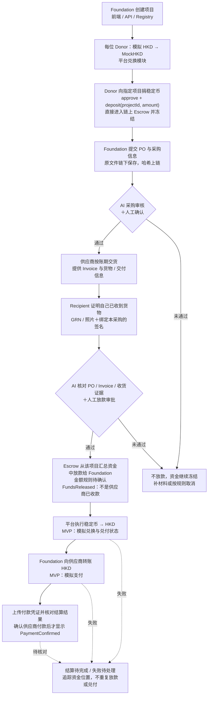

# PoG — Foundation 兑付与供应商结算流程

日期：2026-10-02。状态：资金来源、模拟兑换及收货／付款角色已由用户确认；
放款金额规则待确认。新架构尚未实现，不代表真实 HKD／稳定币兑付已经接入。

本次流程取代 M2 原计划的「Escrow 直接向供应商支付稳定币」。
已验收的 `blockchain-v0.1.0-m1` 和旧 RC 保持不变。旧架构 M2 编码及其验收
测试已停止；新合约／签名／接口设计须依据确认后的流程重新下发。
旧 Escrow 未提交草稿仍保留在工作区，不是已验证代码或新方案的候选实现。

## 当前流程图

每位 Donor 先在平台把模拟 HKD 兑换为 MockHKD，再以稳定币向指定项目捐款。
捐款直接存入该项目的链上 Escrow 并锁定，不先进入 Foundation 的 HKD 账户。
用户确认两次兑换均模拟；Recipient 确认收货，Foundation 最终向供应商支付 HKD。



## 谁负责什么

- Donor：先将自己的模拟 HKD 换成 MockHKD；只能向指定项目捐款，资金直接进入
  该项目 Escrow，不能直接捐入 Foundation 的自由余额。
- Foundation：创建项目、提交 PO／采购材料；获批后领取稳定币、
  通过平台换回 HKD，再向固定供应商付款并提交付款证据。
- Recipient：证明本采购的货物已经收到，不因为确认收货而自动获得资金审批权。
  拟使用绑定项目／采购／交付证据的独立签名；具体 EIP-712 格式待新接口设计。
- AI：第一次检查 PO／采购材料；第二次比对 PO、Invoice、货物信息与收货证据。
  AI 只产生风险报告，不替代人工批准、不自行执行兑付。
- 人工审批人：查看 AI 结果与收货证明，签署明确金额与收款 Foundation 的放款批准。
- Smart Contract：托管／冻结稳定币，验证必要签名和证据绑定，执行一次性放款，
  记录真实链上资金变化。不能直接证明货物真实到达或银行真实到账。
- 平台兑换与 Payment 模块：处理 HKD↔稳定币的操作资源、报价／状态／对账，
  追踪 Foundation 的 HKD 供应商支付；不能把链上 mint/burn 当作真实法币兑付。
- API／数据库与前端：保存原始材料与模拟法币账本，展示项目、审核、放款、兑换、
  HKD 支付的分别确认状态，保留原三端 booth 的角色边界。

## 新的验收口径

建议状态序列（非已经冻结的 Solidity enum）：

```text
ProjectCreated → FundsLocked → POReviewed → DeliveryConfirmed
→ ReleaseApproved → FundsReleased → RedemptionPending
→ HKDReady → SupplierPaymentPending → PaymentConfirmed
```

`FundsReleased` 只能表示 Foundation 的稳定币余额增加。
`PaymentConfirmed` 才能表示供应商 HKD 付款有对应的、已核对的凭证／结算记录；
黑客松模拟时必须明确标记为模拟，不声称真实银行到账。

放款金额规则还未确定。建议：同项目多个 Donor 的捐款汇总，按最终获批 Invoice
金额释放，不逐笔处理 Donor。若冻结 100 个演示单位，Invoice 为 72，则释放 72
给 Foundation，剩余 28 留在同项目 Escrow 中，继续冻结。
另一种「验收后释放全部 100」需要用户明确选择，不能默认为授权。

建议 demo 使用 HKD 锚定 MockHKD、1:1 兑换、零手续费；这是演示参数，不代表
真实兑换价格、储备或赎回能力，也不能套用到美元稳定币。

新流程假设供应商接受先交货、后付款的账期；不是先付款采购，也不是 Foundation
已经垫款后再报销。Foundation 若已经支付，必须另行定义报销与防重复付款规则。

## 与已验收 M1 的差异

- M1 的 Registry 将 `Paid` 及其 Allocation Root 关联到旧的链上供应商付款语义。
  不能把「向 Foundation 放款」冒充同一意义的 `Paid`。
- 原付款 termsHash 绑定 vendor；新版必须区分稳定币放款接收方 Foundation 与
  最终 HKD 供应商，重新冻结相关数据、事件、签名与 proof 口径。
- Recipient 的本人收货确认是新增证据关口，不由 Foundation 上传一张图片自动代替。
- 链上合约无法强制 Foundation 在收取可转移稳定币后完成链下 HKD 付款。
  后续兑付／支付对账是新方案的信任边界，不能声称原有链上直付保障仍然存在。
- 原「无提现」限制需要收窄为「无任意提现，仅允许已批准、绑定采购的 Foundation
  放款／兑付路径」；退款、关闭项目和行政提现仍不应自动加入范围。

## 已确认与剩余决定

- 已确认：Donor 自己换稳定币，再捐入指定项目的链上托管；所有项目捐款锁定。
- 已确认：两次兑换均为模拟，不接真实银行或真实稳定币兑付。
- 已确认：Recipient 证明收货；Foundation 换回 HKD 后向供应商付款。
- 待确认：按获批 Invoice 金额释放，还是验收后释放项目全部资金？

确认放款金额后再更新正式合约规格和跨组接口，并重新下发 M2。
不要继续实现旧直付版本。
